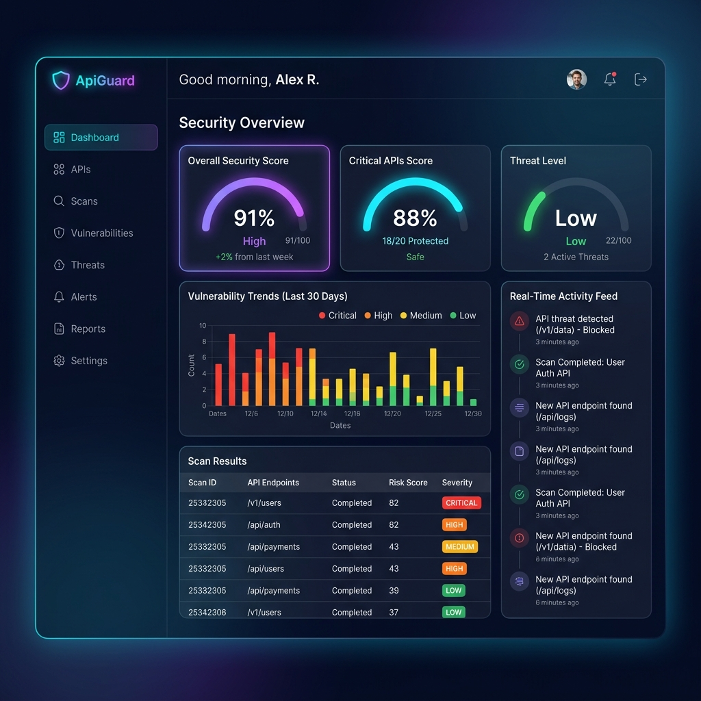

<p align="center">
  
</p>

<h1 align="center">🛡️ ApiGuard</h1>

<p align="center">
  <strong>Real-Time API Security Scanning & Vulnerability Management Platform</strong>
</p>

<p align="center">
  
  
  
  
  
  
  
</p>

---

## 📋 Overview

**ApiGuard** is a full-stack SaaS platform for automated API security scanning based on the **OWASP API Security Top 10**. It enables development teams to identify vulnerabilities across their API endpoints, integrate security checks into CI/CD pipelines, and monitor API health through a unified dashboard.

### Key Capabilities

- 🔍 **Automated Vulnerability Scanning** — Run OWASP API Top 10 security checks against any endpoint with real-time progress streaming
- 📄 **OpenAPI Spec Parser** — Import, validate, and parse OpenAPI 3.x / Swagger specs with version diff detection
- 📬 **Postman Integration** — Connect Postman workspaces, sync collections, and trigger scans directly
- 🐙 **GitHub Repository Monitoring** — Track connected repositories, trigger scans, and view security posture per repo
- ⚙️ **CI/CD Pipeline Integration** — Embed security gates into GitHub Actions with pass/fail enforcement based on scan scores
- 📊 **PDF Report Generation** — Generate and manage security audit reports with scoring summaries
- 🔔 **Real-Time Alerts** — Receive alerts for critical vulnerabilities and pipeline failures
- 🏗️ **Infrastructure Dashboard** — Monitor service health, uptime, and tune worker concurrency settings

---

## 🏗️ Architecture

```
┌─────────────────────────────────────────────────────────────┐
│                        FRONTEND                             │
│                  React 19 + Zustand + Vite                  │
│          Dashboard · Scan · OpenAPI · Postman · CI/CD       │
│        GitHub · Reports · Alerts · Analytics · Infra        │
└────────────────────────┬────────────────────────────────────┘
                         │ HTTP / SSE
┌────────────────────────▼────────────────────────────────────┐
│                     API SERVER                              │
│               Express.js + JWT Auth                         │
│     REST Endpoints · File Upload · SSE Streaming            │
└───────┬──────────────────────────────────┬──────────────────┘
        │                                  │
┌───────▼──────────┐              ┌────────▼─────────┐
│   PostgreSQL 15  │              │    Redis 7       │
│                  │              │                  │
│  users · scans   │              │  BullMQ Queue    │
│  specs · alerts  │              │  Pub/Sub (SSE)   │
│  reports · repos │              │  Job Progress    │
└──────────────────┘              └────────┬─────────┘
                                           │
                                  ┌────────▼─────────┐
                                  │   SCAN WORKER    │
                                  │                  │
                                  │  OWASP Top 10    │
                                  │  Vulnerability   │
                                  │  Detection       │
                                  └──────────────────┘
```

---

## 📁 Project Structure

```
apiguard/
├── src/                        # Frontend (React)
│   ├── App.jsx                 # Main application with all views
│   ├── store.js                # Zustand global state management
│   └── api.js                  # Axios client with token refresh
│
├── backend/                    # Backend (Node.js / Express)
│   ├── server.js               # Express API server (all endpoints)
│   ├── worker.js               # BullMQ scan engine worker
│   ├── db.js                   # PostgreSQL schema & migrations
│   ├── queue.js                # BullMQ queue configuration
│   ├── Dockerfile              # Backend Docker image
│   └── templates/
│       └── apiguard-scan.yml   # GitHub Actions workflow template
│
├── docker-compose.yml          # Full-stack Docker orchestration
├── Dockerfile                  # Frontend Docker image
├── vite.config.js              # Vite config with API proxy
└── package.json                # Frontend dependencies
```

---

## 🚀 Getting Started

### Prerequisites

| Tool | Version |
|------|---------|
| [Node.js](https://nodejs.org/) | 20+ |
| [Docker](https://www.docker.com/) | 24+ |
| [Docker Compose](https://docs.docker.com/compose/) | 2.20+ |

### Option 1: Docker (Recommended)

Spin up the entire stack with one command:

```bash
docker compose up
```

This starts all 5 services:

| Service | Port | Description |
|---------|------|-------------|
| `frontend` | [localhost:5173](http://localhost:5173) | Vite React dev server |
| `api` | [localhost:5000](http://localhost:5000) | Express API server |
| `worker` | — | BullMQ scan engine worker |
| `db` | 5432 | PostgreSQL 15 database |
| `redis` | 6379 | Redis 7 (queue + pub/sub) |

### Option 2: Local Development

**1. Start infrastructure services:**

```bash
docker compose up db redis -d
```

**2. Install and start the backend:**

```bash
cd backend
npm install
node server.js &
node worker.js &
```

**3. Install and start the frontend:**

```bash
npm install
npm run dev
```

**4. Open the app:**

Navigate to [http://localhost:5173](http://localhost:5173)

### Default Login

```
Email:    admin@apiguard.io
Password: password123
```

---

## 🔧 API Endpoints

### Authentication

| Method | Endpoint | Description |
|--------|----------|-------------|
| `POST` | `/api/auth/register` | Register a new user |
| `POST` | `/api/auth/login` | Login with email & password |
| `POST` | `/api/auth/refresh` | Refresh access token |
| `POST` | `/api/auth/logout` | Invalidate refresh token |
| `GET` | `/api/auth/me` | Get current user profile |

### Scan Engine

| Method | Endpoint | Description |
|--------|----------|-------------|
| `POST` | `/api/scans` | Trigger a new vulnerability scan |
| `GET` | `/api/scans` | List all scans for the user |
| `GET` | `/api/scans/:id` | Get scan details with findings |
| `DELETE` | `/api/scans/:id` | Delete a scan |
| `GET` | `/api/scans/:id/stream` | SSE stream for real-time scan progress |

### OpenAPI Parser

| Method | Endpoint | Description |
|--------|----------|-------------|
| `POST` | `/api/openapi/import` | Import & parse an OpenAPI spec |
| `GET` | `/api/openapi/specs` | List imported specs |
| `GET` | `/api/openapi/specs/:id/endpoints` | List parsed endpoints |
| `POST` | `/api/openapi/specs/:id/scan` | Trigger scan from spec |

### Postman Integration

| Method | Endpoint | Description |
|--------|----------|-------------|
| `POST` | `/api/postman/connect` | Connect Postman with API key |
| `GET` | `/api/postman/collections` | List synced collections |
| `POST` | `/api/postman/collections/:id/scan` | Scan a Postman collection |
| `DELETE` | `/api/postman/disconnect` | Disconnect Postman workspace |
| `POST` | `/api/postman/webhook` | Postman webhook receiver |

### GitHub Integration

| Method | Endpoint | Description |
|--------|----------|-------------|
| `GET` | `/api/github/repos` | List connected repositories |
| `POST` | `/api/github/repos/:owner/:repo/scan` | Trigger scan for a repository |

### CI/CD Pipeline

| Method | Endpoint | Description |
|--------|----------|-------------|
| `POST` | `/api/cicd/token` | Generate CI/CD API token |
| `GET` | `/api/cicd/runs` | List pipeline runs |
| `POST` | `/api/cicd/scan` | Trigger scan from CI pipeline |

### Reports, Alerts & Infrastructure

| Method | Endpoint | Description |
|--------|----------|-------------|
| `GET` | `/api/reports` | List security reports |
| `POST` | `/api/reports/generate` | Generate a new report |
| `DELETE` | `/api/reports/:id` | Delete a report |
| `GET` | `/api/alerts` | List alerts |
| `PATCH` | `/api/alerts/:id/read` | Mark alert as read |
| `PATCH` | `/api/alerts/read-all` | Mark all alerts as read |
| `GET` | `/api/infra/status` | Get service health status |
| `GET` | `/api/infra/tuning` | Get worker tuning config |
| `POST` | `/api/infra/tuning` | Update worker tuning config |

---

## ⚙️ CI/CD Integration

ApiGuard can be embedded into your GitHub Actions pipeline as a security gate. Copy the workflow template from `backend/templates/apiguard-scan.yml` into your repository:

```yaml
# .github/workflows/apiguard-scan.yml
name: ApiGuard Security Scan

on:
  push:
    branches: [main, develop]
  pull_request:
    branches: [main]

jobs:
  security-scan:
    runs-on: ubuntu-latest
    steps:
      - uses: actions/checkout@v4
      - name: Trigger security scan
        run: |
          curl -s -X POST "${{ vars.APIGUARD_API_URL }}/api/cicd/scan" \
            -H "Authorization: Bearer ${{ secrets.APIGUARD_TOKEN }}" \
            -H "Content-Type: application/json" \
            -d '{"repoName": "${{ github.repository }}", "branch": "${{ github.ref_name }}"}'
```

**Pass/Fail Gate:**
- Score **≥ 75** and **0 critical findings** → ✅ Pipeline passes
- Score **< 75** or **any critical findings** → ❌ Pipeline fails

---

## 🗃️ Database Schema

```
users ──────────┐
                │
specs ──────────┤─── endpoints
                │
scans ──────────┤
                │
postman_collections ┤
                │
github_connections ─┤
                │
pipeline_runs ──┤
                │
reports ────────┤
                │
alerts ─────────┘

system_tuning (key-value config store)
```

---

## 🧰 Tech Stack

| Layer | Technology |
|-------|-----------|
| **Frontend** | React 19, Zustand, Recharts, Tabler Icons, Vite |
| **Backend** | Node.js 20, Express 4, JWT, Multer, bcryptjs |
| **Database** | PostgreSQL 15 |
| **Queue** | Redis 7 + BullMQ |
| **Streaming** | Server-Sent Events (SSE) via Redis Pub/Sub |
| **Containerization** | Docker, Docker Compose |
| **CI/CD** | GitHub Actions |

---

## 🔐 Environment Variables

| Variable | Default | Description |
|----------|---------|-------------|
| `PORT` | `5000` | API server port |
| `DB_HOST` | `localhost` | PostgreSQL host |
| `DB_USER` | `postgres` | PostgreSQL user |
| `DB_PASSWORD` | `postgres` | PostgreSQL password |
| `DB_NAME` | `apiguard` | PostgreSQL database name |
| `DB_PORT` | `5432` | PostgreSQL port |
| `REDIS_HOST` | `localhost` | Redis host |
| `REDIS_PORT` | `6379` | Redis port |
| `JWT_SECRET` | `apiguard_super_secret_jwt_key_2026` | JWT signing secret |
| `JWT_REFRESH_SECRET` | `apiguard_super_secret_jwt_refresh_key_2026` | JWT refresh token secret |

---

## 📜 License

This project is developed as part of the **TrustLayer Labs Internship Program** — Team Beta.
