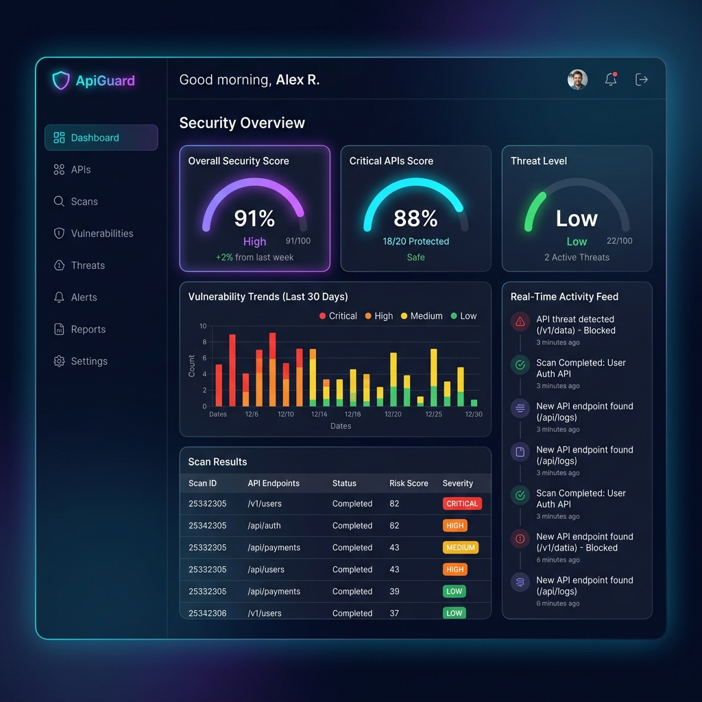

<p align="center">
  
</p>

<h1 align="center">🛡️ ApiGuard</h1>

<p align="center">
  <strong>Real-Time API Security Scanning & Vulnerability Management Platform</strong>
</p>

<p align="center">
  
  
  
  
  
  
  
</p>

---

## 📋 Overview

**ApiGuard** is a full-stack SaaS platform for automated API security scanning based on the **OWASP API Security Top 10**. It enables development teams to identify vulnerabilities across their APIs, manage security posture, and integrate security gates into CI/CD pipelines.

### Key Capabilities

- 🔍 **Automated Vulnerability Scanning** — Run OWASP API Top 10 security checks against any endpoint with real-time progress streaming
- 📄 **OpenAPI Spec Parser** — Import, validate, and parse OpenAPI 3.x / Swagger specs with version diff detection
- 📬 **Postman Integration** — Connect Postman workspaces, sync collections, and trigger scans directly
- 🐙 **GitHub Repository Monitoring** — Track connected repositories, trigger scans, and view security posture per repo
- ⚙️ **CI/CD Pipeline Integration** — Embed security gates into GitHub Actions with pass/fail enforcement based on scan scores
- 📊 **PDF Report Generation** — Generate and manage security audit reports with scoring summaries
- 🔔 **Real-Time Alerts** — Receive alerts for critical vulnerabilities and pipeline failures
- 🏗️ **Infrastructure Dashboard** — Monitor service health, uptime, and tune worker concurrency settings

---

## 🏗️ Architecture

```
┌─────────────────────────────────────────────────────────────┐
│                        FRONTEND                             │
│                  React 19 + Zustand + Vite                  │
│          Dashboard · Scan · OpenAPI · Postman · CI/CD       │
│        GitHub · Reports · Alerts · Analytics · Infra        │
└────────────────────────┬────────────────────────────────────┘
                         │ HTTP / SSE
┌────────────────────────▼────────────────────────────────────┐
│                     API SERVER                              │
│               Express.js + JWT Auth                         │
│     REST Endpoints · File Upload · SSE Streaming            │
└───────┬──────────────────────────────────┬──────────────────┘
        │                                  │
┌───────▼──────────┐              ┌────────▼─────────┐
│   PostgreSQL 15  │              │    Redis 7       │
│                  │              │                  │
│  users · scans   │              │  BullMQ Queue    │
│  specs · alerts  │              │  Pub/Sub (SSE)   │
│  reports · repos │              │  Job Progress    │
└──────────────────┘              └────────┬─────────┘
                                           │
                                  ┌────────▼─────────┐
                                  │   SCAN WORKER    │
                                  │                  │
                                  │  OWASP Top 10    │
                                  │  Vulnerability   │
                                  │  Detection       │
                                  └──────────────────┘
```

---

## 📁 Project Structure

```
apiguard/
├── src/                        # Frontend (React)
│   ├── App.jsx                 # Main application with all views
│   ├── store.js                # Zustand global state management
│   └── api.js                  # Axios client with token refresh
│
├── backend/                    # Backend (Node.js / Express)
│   ├── server.js               # Express API server (all endpoints)
│   ├── worker.js               # BullMQ scan engine worker
│   ├── db.js                   # PostgreSQL schema & migrations
│   ├── queue.js                # BullMQ queue configuration
│   ├── Dockerfile              # Backend Docker image
│   └── templates/
│       └── apiguard-scan.yml   # GitHub Actions workflow template
│
├── docker-compose.yml          # Full-stack Docker orchestration
├── Dockerfile                  # Frontend Docker image
├── vite.config.js              # Vite config with API proxy
└── package.json                # Frontend dependencies
```

---

## 🚀 Getting Started

### Prerequisites

| Tool | Version |
|------|---------|
| [Node.js](https://nodejs.org/) | 20+ |
| [Docker](https://www.docker.com/) | 24+ |
| [Docker Compose](https://docs.docker.com/compose/) | 2.20+ |
| [Git](https://git-scm.com/) | Latest |

---

## 🔑 Authentication Guide

### GitHub Login

To clone and access this repository:

1. **Ensure you have Git installed**
   ```bash
   git --version
   ```

2. **Clone the repository**
   ```bash
   git clone https://github.com/uppalriya371-blip/TeamBeta.git
   cd TeamBeta
   ```

3. **Configure Git with your GitHub credentials**
   ```bash
   git config --global user.name "Your Name"
   git config --global user.email "your.email@example.com"
   ```

### Application Login

Once the app is running, use the default credentials to log in:

```
Email:    admin@apiguard.io
Password: password123
```

**To create a new account:**
- Click "Sign up" on the login page
- Enter your name, email, and password
- Confirm your email (if email verification is enabled)
- Log in with your credentials

---

## 🎯 Run Locally

### Option 1: Docker (Recommended - Fastest Setup)

This is the easiest way to get the entire stack running with minimal configuration.

**Step 1: Clone the repository**
```bash
git clone https://github.com/uppalriya371-blip/TeamBeta.git
cd TeamBeta
```

**Step 2: Start all services with Docker Compose**
```bash
docker compose up
```

This command will:
- Build and start the frontend (Vite React dev server)
- Build and start the backend (Express API server)
- Start the BullMQ scan worker
- Start PostgreSQL database
- Start Redis cache & queue

**Step 3: Wait for services to be ready**

You'll see logs indicating when each service is ready. Wait for a message like:
```
api       | ✅ API Server running on http://localhost:5000
frontend  | ✅ Vite dev server running on http://localhost:5173
```

**Step 4: Access the application**

Open your browser and navigate to:
```
http://localhost:5173
```

**Step 5: Log in with default credentials**
```
Email:    admin@apiguard.io
Password: password123
```

**To stop all services:**
```bash
docker compose down
```

---

### Option 2: Local Development (Manual Setup)

For development work or if you prefer running services locally.

**Step 1: Clone the repository**
```bash
git clone https://github.com/uppalriya371-blip/TeamBeta.git
cd TeamBeta
```

**Step 2: Start infrastructure services (PostgreSQL & Redis) via Docker**
```bash
docker compose up db redis -d
```

Wait for the containers to be ready (about 5-10 seconds).

**Step 3: Set up and start the backend**

In a new terminal window:
```bash
cd backend
npm install
```

Create a `.env` file in the `backend/` directory (or use defaults):
```env
PORT=5000
DB_HOST=localhost
DB_USER=postgres
DB_PASSWORD=postgres
DB_NAME=apiguard
DB_PORT=5432
REDIS_HOST=localhost
REDIS_PORT=6379
JWT_SECRET=apiguard_super_secret_jwt_key_2026
JWT_REFRESH_SECRET=apiguard_super_secret_jwt_refresh_key_2026
```

Start the API server:
```bash
node server.js
```

In another terminal, start the BullMQ worker:
```bash
node worker.js
```

You should see:
```
✅ API Server running on http://localhost:5000
✅ Worker connected and listening for jobs
```

**Step 4: Set up and start the frontend**

In a new terminal window (from the root directory):
```bash
npm install
npm run dev
```

You should see:
```
✅ Vite dev server running on http://localhost:5173
```

**Step 5: Access the application**

Open your browser and navigate to:
```
http://localhost:5173
```

**Step 6: Log in**
```
Email:    admin@apiguard.io
Password: password123
```

**To stop services:**

- Frontend: Press `Ctrl+C` in the frontend terminal
- Backend: Press `Ctrl+C` in each backend terminal
- Database & Redis: 
  ```bash
  docker compose down
  ```

---

## 📊 Service URLs & Ports

When running locally, you can access the following services:

| Service | URL | Port | Notes |
|---------|-----|------|-------|
| **Frontend** | http://localhost:5173 | 5173 | Vite React dev server |
| **API Server** | http://localhost:5000 | 5000 | Express API endpoints |
| **PostgreSQL** | localhost | 5432 | Database (Docker only) |
| **Redis** | localhost | 6379 | Cache & queue (Docker only) |
| **Worker** | — | — | Background job processor (Docker/Manual) |

---

## 🧪 Testing the Application

### Test API Endpoints

**1. Register a new account:**
```bash
curl -X POST http://localhost:5000/api/auth/register \
  -H "Content-Type: application/json" \
  -d '{
    "name": "John Doe",
    "email": "john@example.com",
    "password": "securePassword123"
  }'
```

**2. Login:**
```bash
curl -X POST http://localhost:5000/api/auth/login \
  -H "Content-Type: application/json" \
  -d '{
    "email": "admin@apiguard.io",
    "password": "password123"
  }'
```

**3. Get current user profile (requires token):**
```bash
curl -X GET http://localhost:5000/api/auth/me \
  -H "Authorization: Bearer <your_access_token>"
```

### Manual Testing via UI

1. Log in with default credentials
2. Navigate to **Scan** → Create a new scan
3. Enter an API endpoint (e.g., `https://api.example.com/users`)
4. Click "Start Scan" and watch real-time progress
5. Review vulnerability findings
6. Generate a PDF report from the Reports tab

---

## 🔧 API Endpoints

### Authentication

| Method | Endpoint | Description |
|--------|----------|-------------|
| `POST` | `/api/auth/register` | Register a new user |
| `POST` | `/api/auth/login` | Login with email & password |
| `POST` | `/api/auth/refresh` | Refresh access token |
| `POST` | `/api/auth/logout` | Invalidate refresh token |
| `GET` | `/api/auth/me` | Get current user profile |

### Scan Engine

| Method | Endpoint | Description |
|--------|----------|-------------|
| `POST` | `/api/scans` | Trigger a new vulnerability scan |
| `GET` | `/api/scans` | List all scans for the user |
| `GET` | `/api/scans/:id` | Get scan details with findings |
| `DELETE` | `/api/scans/:id` | Delete a scan |
| `GET` | `/api/scans/:id/stream` | SSE stream for real-time scan progress |

### OpenAPI Parser

| Method | Endpoint | Description |
|--------|----------|-------------|
| `POST` | `/api/openapi/import` | Import & parse an OpenAPI spec |
| `GET` | `/api/openapi/specs` | List imported specs |
| `GET` | `/api/openapi/specs/:id/endpoints` | List parsed endpoints |
| `POST` | `/api/openapi/specs/:id/scan` | Trigger scan from spec |

### Postman Integration

| Method | Endpoint | Description |
|--------|----------|-------------|
| `POST` | `/api/postman/connect` | Connect Postman with API key |
| `GET` | `/api/postman/collections` | List synced collections |
| `POST` | `/api/postman/collections/:id/scan` | Scan a Postman collection |
| `DELETE` | `/api/postman/disconnect` | Disconnect Postman workspace |
| `POST` | `/api/postman/webhook` | Postman webhook receiver |

### GitHub Integration

| Method | Endpoint | Description |
|--------|----------|-------------|
| `GET` | `/api/github/repos` | List connected repositories |
| `POST` | `/api/github/repos/:owner/:repo/scan` | Trigger scan for a repository |

### CI/CD Pipeline

| Method | Endpoint | Description |
|--------|----------|-------------|
| `POST` | `/api/cicd/token` | Generate CI/CD API token |
| `GET` | `/api/cicd/runs` | List pipeline runs |
| `POST` | `/api/cicd/scan` | Trigger scan from CI pipeline |

### Reports, Alerts & Infrastructure

| Method | Endpoint | Description |
|--------|----------|-------------|
| `GET` | `/api/reports` | List security reports |
| `POST` | `/api/reports/generate` | Generate a new report |
| `DELETE` | `/api/reports/:id` | Delete a report |
| `GET` | `/api/alerts` | List alerts |
| `PATCH` | `/api/alerts/:id/read` | Mark alert as read |
| `PATCH` | `/api/alerts/read-all` | Mark all alerts as read |
| `GET` | `/api/infra/status` | Get service health status |
| `GET` | `/api/infra/tuning` | Get worker tuning config |
| `POST` | `/api/infra/tuning` | Update worker tuning config |

---

## ⚙️ CI/CD Integration

ApiGuard can be embedded into your GitHub Actions pipeline as a security gate. Copy the workflow template from `backend/templates/apiguard-scan.yml` into your repository:

```yaml
# .github/workflows/apiguard-scan.yml
name: ApiGuard Security Scan

on:
  push:
    branches: [main, develop]
  pull_request:
    branches: [main]

jobs:
  security-scan:
    runs-on: ubuntu-latest
    steps:
      - uses: actions/checkout@v4
      - name: Trigger security scan
        run: |
          curl -s -X POST "${{ vars.APIGUARD_API_URL }}/api/cicd/scan" \
            -H "Authorization: Bearer ${{ secrets.APIGUARD_TOKEN }}" \
            -H "Content-Type: application/json" \
            -d '{"repoName": "${{ github.repository }}", "branch": "${{ github.ref_name }}"}'
```

**Pass/Fail Gate:**
- Score **≥ 75** and **0 critical findings** → ✅ Pipeline passes
- Score **< 75** or **any critical findings** → ❌ Pipeline fails

---

## 🗃️ Database Schema

```
users ──────────┐
                │
specs ──────────┤─── endpoints
                │
scans ──────────┤
                │
postman_collections ┤
                │
github_connections ─┤
                │
pipeline_runs ──┤
                │
reports ────────┤
                │
alerts ─────────┘

system_tuning (key-value config store)
```

---

## 🧰 Tech Stack

| Layer | Technology |
|-------|-----------|
| **Frontend** | React 19, Zustand, Recharts, Tabler Icons, Vite |
| **Backend** | Node.js 20, Express 4, JWT, Multer, bcryptjs |
| **Database** | PostgreSQL 15 |
| **Queue** | Redis 7 + BullMQ |
| **Streaming** | Server-Sent Events (SSE) via Redis Pub/Sub |
| **Containerization** | Docker, Docker Compose |
| **CI/CD** | GitHub Actions |

---

## 🔐 Environment Variables

| Variable | Default | Description |
|----------|---------|-------------|
| `PORT` | `5000` | API server port |
| `DB_HOST` | `localhost` | PostgreSQL host |
| `DB_USER` | `postgres` | PostgreSQL user |
| `DB_PASSWORD` | `postgres` | PostgreSQL password |
| `DB_NAME` | `apiguard` | PostgreSQL database name |
| `DB_PORT` | `5432` | PostgreSQL port |
| `REDIS_HOST` | `localhost` | Redis host |
| `REDIS_PORT` | `6379` | Redis port |
| `JWT_SECRET` | `apiguard_super_secret_jwt_key_2026` | JWT signing secret |
| `JWT_REFRESH_SECRET` | `apiguard_super_secret_jwt_refresh_key_2026` | JWT refresh token secret |

---

## 🆘 Troubleshooting

### Docker Services Won't Start
```bash
# Clean up old containers and volumes
docker compose down -v

# Rebuild and start fresh
docker compose up --build
```

### Port Already in Use
```bash
# Kill process on port 5173 (frontend)
lsof -ti:5173 | xargs kill -9

# Kill process on port 5000 (API)
lsof -ti:5000 | xargs kill -9

# Kill process on port 5432 (database)
lsof -ti:5432 | xargs kill -9
```

### Database Connection Errors
```bash
# Check if PostgreSQL container is running
docker ps | grep postgres

# View database logs
docker compose logs db
```

### Can't Access API from Frontend
- Ensure API is running on `http://localhost:5000`
- Check that CORS is enabled in `backend/server.js`
- Verify the Vite proxy is configured in `vite.config.js`

### Worker Not Processing Jobs
```bash
# Check Redis is running
docker ps | grep redis

# View worker logs
docker compose logs worker
```

---

## 📜 License

This project is developed as part of the **TrustLayer Labs Internship Program** — Team Beta.
